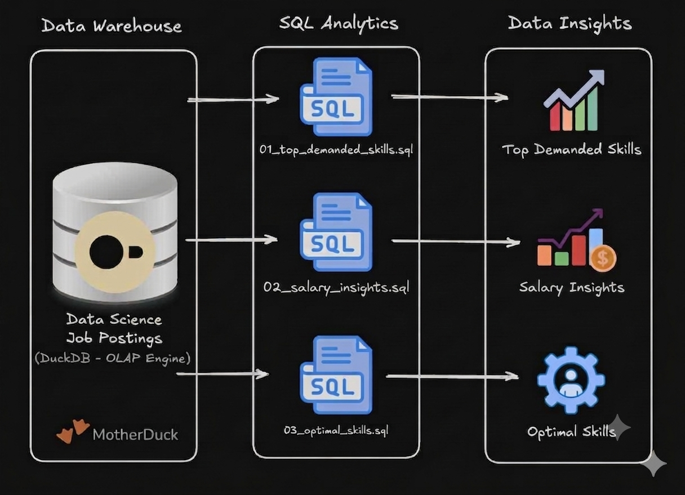

# Exploratory Data Analysis (EDA) - SQL Job Market Analytics

<p align="center">
  
</p>

A SQL project analyzing the data engineer job market using real-world job posting data. It demonstrates my ability to **write production-quality analytical SQL, design efficient queries, and turn business questions into data-driven insights**.

---

## 🧾 Executive Summary (For Hiring Managers)

- **Project scope:** Built 4 analytical queries across 3 scripts, answering key questions about the data engineer job market
- **Data modeling:** Used multi-table joins across fact, dimension, and bridge tables to extract insights
- **Analytics:** Applied aggregations, filtering, sorting, CTEs, and window functions to find top skills by demand, salary, and overall value
- **Outcomes:** Delivered actionable insights on SQL/Python dominance, cloud trends, salary patterns, and top-paying companies

If you only have a minute, review these:
1. [`01_top_demanded_skills.sql`](./01_top_demanded_skills.sql) – demand analysis with multi-table joins
2. [`02_salary_insights.sql`](./02_salary_insights.sql) – salary analysis by skill and by company (CTE + window functions)
3. [`03_optimal_skills.sql`](./03_optimal_skills.sql) – combined demand/salary optimization query

---

## 🧩 Problem & Context

Job market analysts need to answer questions like:
- **Most in-demand:** Which skills are most in-demand for data engineers?
- **Highest paid:** Which skills and which companies command the highest salaries?
- **Best trade-off:** What is the optimal skill set balancing demand and compensation?

This project analyzes a data warehouse built using a star schema design. The warehouse structure consists of:


<p align="center">
  
</p>

### 📊 DESCRIBE job_postings_fact;
*The core fact table containing detailed information about individual job listings.*

```text
┌──────────────────────────────────────────┐
│ job_postings_fact                        │
│                                          │
│ job_id integer not null                  │ -- PRIMARY KEY
│ company_id integer                       │ -- FOREIGN KEY
│ job_title_short varchar                  │
│ job_title varchar                        │
│ job_location varchar                     │
│ job_via varchar                          │
│ job_schedule_type varchar                │
│ job_work_from_home boolean               │
│ search_location varchar                  │
│ job_posted_date timestamp                │
│ job_no_degree_mention boolean            │
│ job_health_insurance boolean             │
│ job_country varchar                      │
│ salary_rate varchar                      │
│ salary_year_avg double                   │
│ salary_hour_avg double                   │
└──────────────────────────────────────────┘
```

### 🏢 DESCRIBE company_dim;
*Dimension table containing detailed information about the hiring companies.*

```text
┌──────────────────────────────┐
│ company_dim                  │
│                              │
│ company_id integer not null  │ -- PRIMARY KEY
│ name varchar                 │
│ link varchar                 │
│ link_google varchar          │
│ thumbnail varchar            │
└──────────────────────────────┘
```

### 🧩 DESCRIBE skills_dim;
*Catalog of technical skills identified in job postings.*

```text
┌───────────────────────────┐
│ skills_dim                │
│                           │
│ skill_id integer not null │ -- PRIMARY KEY
│ skills varchar            │
│ type varchar              │
└───────────────────────────┘
```

### 🔗 DESCRIBE skills_job_dim;
*Bridge table mapping many-to-many relationships between jobs and skills.*

```text
┌───────────────────────────┐
│ skills_job_dim            │
│                           │
│ skill_id integer not null │ -- FOREIGN KEY
│ job_id integer not null   │ -- FOREIGN KEY
└───────────────────────────┘
```

By querying across these interconnected tables, I extracted insights about skill demand, salary patterns, top-paying companies, and optimal skill combinations for data engineering roles.

---

## 🧰 Tech Stack

- **Query Engine:** DuckDB for fast OLAP-style analytical queries
- **Language:** SQL (ANSI-style with analytical functions)
- **Data Model:** Star schema with fact + dimension + bridge tables
- **Development:** VS Code for SQL editing + Terminal for DuckDB CLI
- **Version Control:** Git/GitHub for versioned SQL scripts

---

## 📂 Repository Structure

```text
1_EDA/
├── 01_top_demanded_skills.sql # Demand analysis query
├── 02_salary_insights.sql     # Salary analysis by skill and by company
├── 03_optimal_skills.sql      # Combined demand/salary optimization
└── README.md                  # You are here
```

---

## 🏗 Analysis Overview

### Query Structure

1. **[Top Demanded Skills](./01_top_demanded_skills.sql)** – Identifies the 10 most in-demand skills for remote data engineer positions
2. **[Salary Insights](./02_salary_insights.sql)** – Two related analyses:
   - **Query 2.1:** The 25 highest-paying skills, with salary and demand metrics
   - **Query 2.2:** The top 10 highest-paying companies, using a CTE and `RANK()` window function to handle ties
3. **[Optimal Skills](./03_optimal_skills.sql)** – Calculates an optimal score using natural log of demand combined with median salary to identify the most valuable skills to learn

### Key Insights

- **Core languages:** SQL and Python each appear in ~29,000 job postings, making them the most demanded skills
- **Cloud platforms:** AWS and Azure are critical for modern data engineering roles
- **Infra & tooling:** Kubernetes, Terraform, and Airflow combine high demand and high pay, challenging the assumption that top salaries only come from niche skills
- **Company pay:** The highest salaries tend to cluster at smaller/niche companies with lower posting volume, while large employers like Meta and Walmart still rank in the top 10 with more consistent hiring volume

---

## 💻 SQL Skills Demonstrated

### Query Design & Optimization

- **Complex Joins:** Multi-table `INNER JOIN` operations across `job_postings_fact`, `skills_job_dim`, `skills_dim`, and `company_dim`
- **CTEs (Common Table Expressions):** Used to pre-aggregate company-level statistics before ranking
- **Window Functions:** `RANK() OVER (ORDER BY ...)` to rank companies by salary while correctly handling ties
- **Aggregations:** `COUNT()`, `MEDIAN()`, `ROUND()` for statistical analysis
- **Filtering:** Boolean logic with `WHERE` clauses and multiple conditions (`job_title_short`, `job_work_from_home`, `salary_year_avg IS NOT NULL`)
- **Sorting & Limiting:** `ORDER BY` with `DESC` and `LIMIT` for top-N analysis

### Data Analysis Techniques

- **Grouping:** `GROUP BY` for categorical analysis by skill and by company
- **Mathematical Functions:** `LN()` for natural logarithm transformation to normalize demand metrics
- **Calculated Metrics:** Derived optimal score combining log-transformed demand with median salary
- **HAVING Clause:** Filtering aggregated results to ensure statistical reliability (e.g., skills with ≥100 postings, companies with ≥5 postings)
- **NULL Handling:** Proper filtering of incomplete records (`salary_year_avg IS NOT NULL`)
