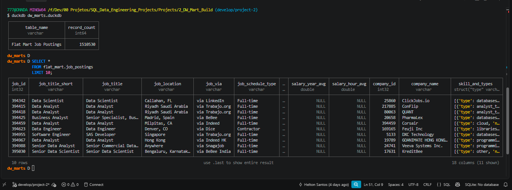
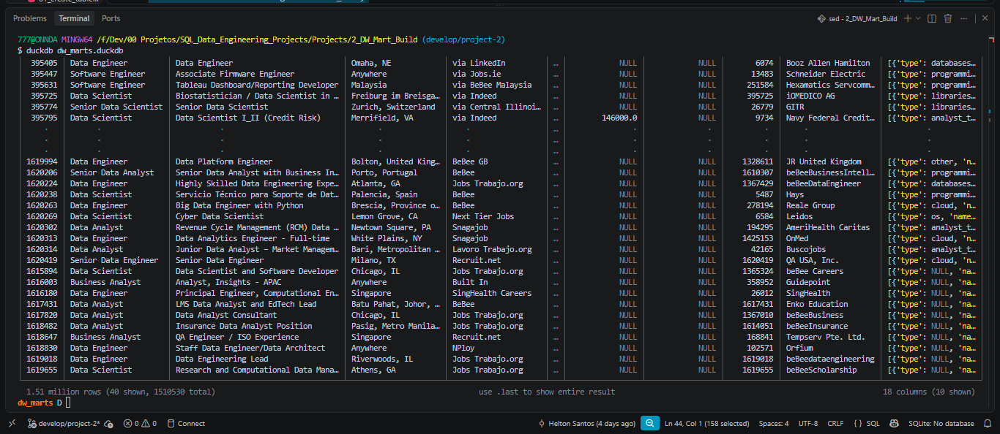
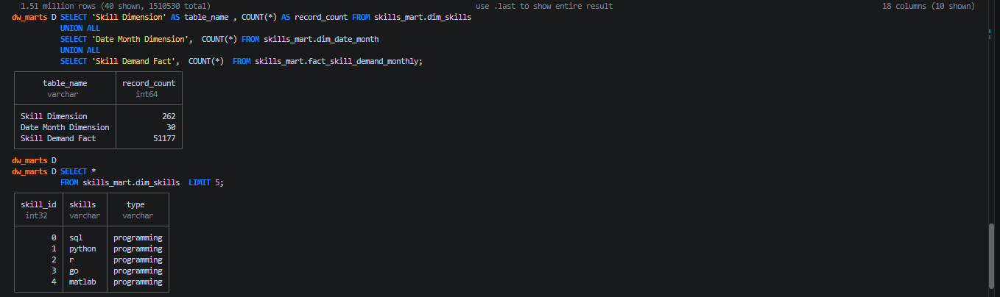
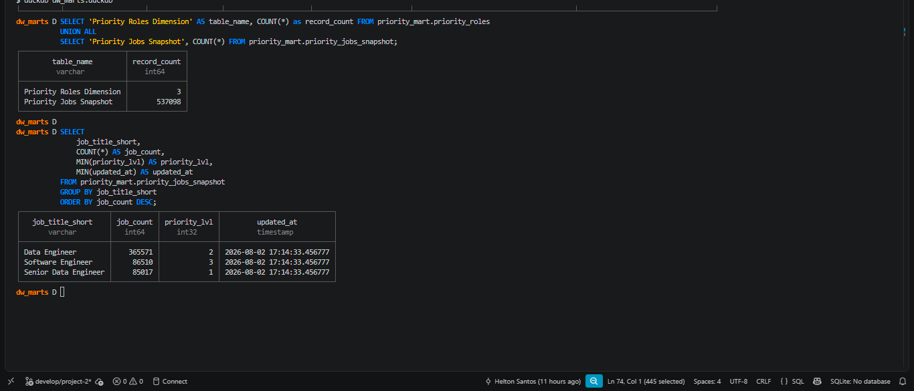
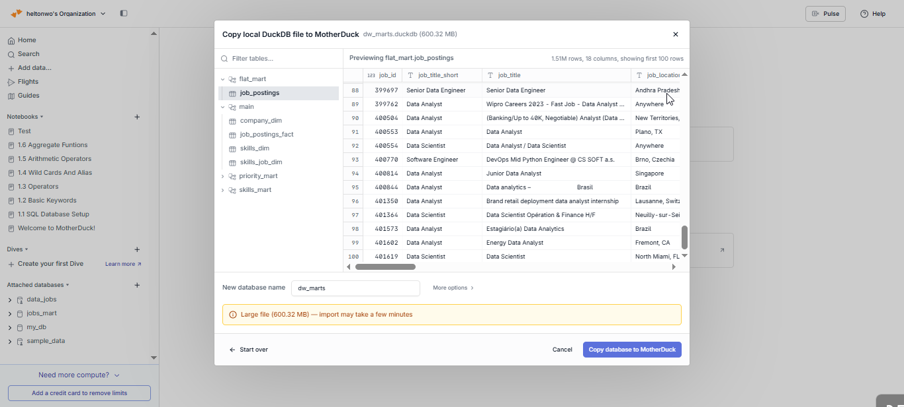
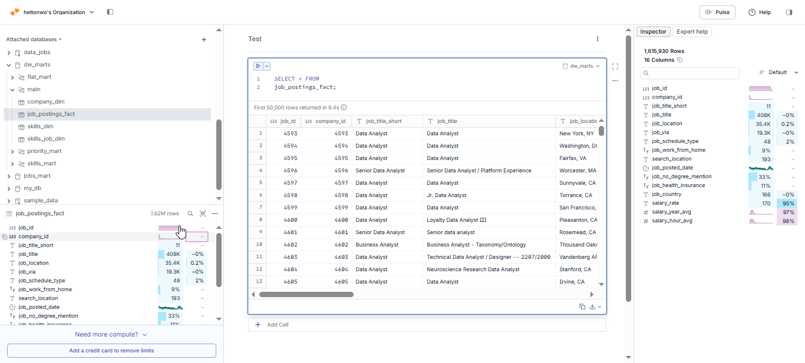
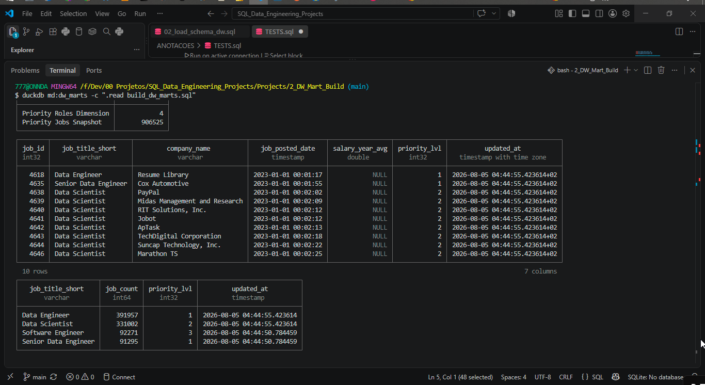

# 🏗️ Data Warehouse & Mart Build: Production ETL Pipeline

An end-to-end data engineering pipeline that transforms raw CSV files from Google Cloud Storage into a normalized star schema data warehouse, then builds analytical data marts on top of it.


---

## 🧾 Executive Summary (For Hiring Managers)

- ✅ **Pipeline scope:** Built a complete **ETL pipeline** from raw CSVs to star schema warehouse to analytical marts
- ✅ **Data modeling:** Designed a **star schema** with fact tables, dimensions, and bridge tables for many-to-many relationships
- ✅ **ETL development:** Implemented **extract, transform, load** processes with idempotent operations and data quality checks
- ✅ **Mart architecture:** Created **specialized data marts** (flat, skills, priority) with additive measures and incremental update patterns

---

## 🧩 Problem & Context

Raw job posting data — over **1.5 million job postings** and **262 distinct skills** — arrives as flat CSV files in Google Cloud Storage, not structured for analytical queries. Analysts need to answer:

- Which skills are most in demand over time?
- What are hiring trends by company and location?
- How do salary patterns vary by role and skill?

**Challenge:** data teams need a single source of truth — a data warehouse — to enable consistent, reliable analysis across the organization. On top of that, specialized data marts are needed to pre-aggregate data for specific business use cases, reducing query complexity and improving performance for common analytical patterns.

**Solution:** an end-to-end ETL pipeline that extracts CSVs from cloud storage, normalizes them into a star schema warehouse (separating facts from dimensions), and builds specialized data marts optimized for specific use cases (flat queries, skill demand analysis, priority role tracking).

---

## 🧰 Tech Stack

- 🐤 **Database:** DuckDB (file-based OLAP database with GCS integration via `httpfs`)
- ☁️ **Cloud:** MotherDuck — cloud-hosted DuckDB, same pipeline runs unmodified locally or in the cloud
- 🧮 **Language:** SQL (DDL for schema design, DML for data loading and transformation)
- 📊 **Data Model:** Star schema (fact + dimension + bridge tables)
- 🛠️ **Development:** VS Code for SQL editing + Terminal for DuckDB CLI execution
- 🔧 **Automation:** Master SQL script for pipeline orchestration
- 📦 **Version Control:** Git/GitHub for versioned pipeline scripts
- ☁️ **Storage:** Google Cloud Storage for source CSV files

---

## 📂 Repository Structure

```text
2_DW_Mart_Build/
├── 01_create_tables_dw.sql        # Star schema DDL
├── 02_load_schema_dw.sql          # GCS data extraction & loading
├── 03_create_flat_mart.sql        # Denormalized flat mart
├── 04_create_skills_mart.sql      # Skills demand mart
├── 05_create_priority_mart.sql    # Priority roles mart
├── 06_update_priority_mart.sql    # Priority mart incremental update (MERGE)
├── build_dw_marts.sql             # Master SQL build script
└── README.md                      # You are here
```

---

## 🏗️ Pipeline Architecture

The pipeline transforms job posting CSVs from Google Cloud Storage into a normalized star schema data warehouse, then builds specialized analytical data marts. BI tools (Excel, Power BI, Tableau, Python) consume from both the warehouse and the marts.

### Data Warehouse

The data warehouse implements a star schema with `company_dim`, `skills_dim`, `job_postings_fact`, and `skills_job_dim` tables.


- **SQL files:**
  - [`01_create_tables_dw.sql`](./01_create_tables_dw.sql) — defines the star schema with 4 core tables
  - [`02_load_schema_dw.sql`](./02_load_schema_dw.sql) — extracts CSVs from GCS and loads them into the warehouse tables
- **Purpose:** star schema serving as the single source of truth for analytical queries
- **Grain:** one row per job posting in the fact table (`job_postings_fact`)
- **Key feature:** filters out orphan `job_id`s before loading the bridge table, avoiding FK violations

### Flat Mart

Denormalized table with all dimensions joined, built for ad-hoc queries.


- **SQL file:** [`03_create_flat_mart.sql`](./03_create_flat_mart.sql) — builds a denormalized table with skills nested as an array of structs
- **Purpose:** fast, join-free exploratory queries
- **Grain:** one row per job posting, with all dimensions joined

### Skills Mart

Time-series skill demand analysis with additive measures.


- **SQL file:** [`04_create_skills_mart.sql`](./04_create_skills_mart.sql) — builds a time-series skill demand mart
- **Purpose:** analyze skill demand over time
- **Grain:** `skill_id + month_started_date + job_title_short`
- **Key feature:** all measures are additive (counts/sums) for safe re-aggregation at any level

### Priority Mart

Priority role tracking with incremental updates using MERGE operations.


- **SQL files:**
  - [`05_create_priority_mart.sql`](./05_create_priority_mart.sql) — initial build of the priority roles and jobs snapshot
  - [`06_update_priority_mart.sql`](./06_update_priority_mart.sql) — **incremental update using MERGE** (upsert pattern)
- **Purpose:** track priority roles and job snapshots, with incremental update capability
- **Grain:** one row per job posting with a priority level assigned
- **Key feature:** `MERGE` handles `INSERT`, `UPDATE`, and `DELETE` in a single statement — a production-ready upsert pattern

---

## 💻 Data Engineering Skills Demonstrated

### ETL Pipeline Development

- **Extract:** direct CSV loading from Google Cloud Storage using DuckDB's `httpfs` extension
- **Transform:** data normalization, type conversion (`CAST`, `DATE_TRUNC`), and quality filtering
- **Load:** idempotent table creation with `DROP TABLE IF EXISTS` patterns
- **Incremental updates:** `MERGE` operations for upsert patterns (INSERT, UPDATE, DELETE in one statement)
- **Orchestration:** master SQL script (`build_dw_marts.sql`) for automated pipeline execution

### Dimensional Modeling

- **Star schema design:** fact table (`job_postings_fact`) with dimension tables (`company_dim`, `skills_dim`)
- **Bridge tables:** many-to-many relationship handling (`skills_job_dim`)
- **Grain definition:** clear, deliberate fact table granularity per mart
- **Additive measures:** counts and sums that can be safely re-aggregated at any level

### SQL Techniques

- **DDL:** `CREATE TABLE`, `DROP TABLE`, `CREATE SCHEMA` for schema management
- **DML:** `INSERT INTO ... SELECT` with explicit column mapping from CSV sources
- **MERGE:** incremental updates using `MERGE INTO` with `WHEN MATCHED`, `WHEN NOT MATCHED`, and `WHEN NOT MATCHED BY SOURCE`
- **CTEs:** for complex transformations and boolean flag conversions
- **Date functions:** `DATE_TRUNC('month')`, `EXTRACT(quarter)` for temporal dimensions
- **Nested types:** `ARRAY_AGG(STRUCT_PACK(...))` for one-row-per-job denormalization
- **Boolean logic:** `CASE WHEN` conversions for aggregating flags (remote, health insurance, no degree)

### Data Quality & Production Practices

- **Idempotency:** all scripts are safely rerunnable without side effects
- **Data validation:** verification queries at each pipeline step to ensure data integrity
- **Type safety:** explicit data type definitions (`VARCHAR`, `INTEGER`, `DOUBLE`, `BOOLEAN`, `TIMESTAMP`)
- **Schema organization:** separate schemas (`flat_mart`, `skills_mart`, `priority_mart`) for logical separation

---

---

## 📸 Pipeline in Action

Real query output from the built warehouse and marts (DuckDB CLI):


*Running the full pipeline with a single command: `duckdb dw_marts.duckdb -c ".read build_dw_marts.sql"`.*


*Flat mart returning 1,510,530 job postings, one row per job with skills nested as structs.*


*Sample of denormalized rows across companies, locations, and titles.*


*Skills mart validation: 262 skills, 30 months, 51,177 rows in the skill-demand fact table.*


*Priority mart snapshot: 537,098 jobs assigned a priority level, grouped by role (local run).*

### Cloud Deployment (MotherDuck)

The same pipeline was also deployed to [MotherDuck](https://motherduck.com), a cloud-hosted DuckDB service — no changes to the SQL, only the connection target.


*Copying the local `dw_marts.duckdb` file (600 MB) to a MotherDuck cloud database.*


*Querying `job_postings_fact` directly in the MotherDuck web UI — 1.6M rows.*


*Running `build_dw_marts.sql` against the cloud database (`duckdb md:dw_marts`) — priority mart snapshot grows to 906,525 rows as the pipeline is re-run against the full dataset.*

---

---

## 🚀 How to Run

### Local database

```bash
duckdb dw_marts.duckdb -c ".read build_dw_marts.sql"
```

### Cloud database (MotherDuck)

```bash
duckdb md:
CREATE DATABASE dw_marts;
duckdb md:dw_marts -c ".read build_dw_marts.sql"
```

The pipeline script (`build_dw_marts.sql`) is environment-agnostic — the same file runs unmodified against either a local DuckDB file or a MotherDuck cloud database. Only the connection target changes.

---

## 📌 Notes

- The flat mart uses a `LEFT JOIN` down to skills — jobs with no associated skills produce a null struct inside the array rather than an empty array.
- The incremental update script is idempotent: it can be run multiple times without duplicating data.